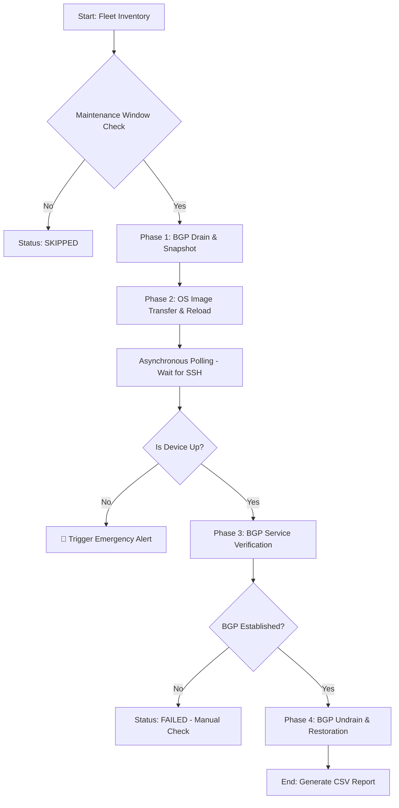

# Enterprise Arista Fleet Upgrade Framework 🚀

A production-grade, closed-loop network automation framework built with Python and `asyncio` to perform Zero-Downtime OS upgrades across thousands of Arista EOS devices. 
*(Arista Network စက်ပေါင်းများစွာကို Network လုံးဝ Down မသွားစေဘဲ (Zero-Downtime) OS အလိုအလျောက် အဆင့်မြှင့်တင်ပေးနိုင်သော Python Automation Framework ဖြစ်ပါသည်။)*

## 🌟 Core Architecture & Features (အဓိက လုပ်ဆောင်ချက်များ)

This project acts as an intelligent orchestrator utilizing Site Reliability Engineering (SRE) principles:
*(ဤ Project သည် ရိုးရှင်းသော Script တစ်ခုမဟုတ်ဘဲ၊ SRE အခြေခံမူများကို အသုံးပြုထားသော Intelligent Orchestrator တစ်ခု ဖြစ်ပါသည်-)*

* **Zero-Downtime Maintenance (Phase 1):** Automatically identifies current BGP states and seamlessly drains traffic using AS-Path Prepending and Outbound Route-Maps.
  *(BGP Traffic များကို ရုတ်တရက် မပိတ်ပစ်ဘဲ AS-Path Prepending အသုံးပြု၍ လမ်းကြောင်းများကို အရင်ဆုံး ညင်သာစွာ ပြောင်းလဲပေးပါသည်။)*
* **Asynchronous Concurrency (Phase 2):** Utilizes `scrapli` and `asyncio` to execute upgrades in parallel. Designed with a "Hit and Run" reload mechanism to handle abrupt SSH disconnections.
  *(စက်များကို တစ်ပြိုင်နက်တည်း Upgrade လုပ်နိုင်ရန် AsyncIO ကို သုံးထားပြီး၊ SSH Connection ရုတ်တရက် ပြတ်ကျသွားမှုကိုလည်း Error မတက်စေဘဲ ကိုင်တွယ်ဖြေရှင်းပေးပါသည်။)*
* **Service-Aware Verification (Phase 3):** Actively monitors BGP routing tables to ensure full protocol convergence (`Established` state) before performing the Undrain operation.
  *(စက်ပြန်တက်လာရုံဖြင့် မပြီးဘဲ၊ BGP Service အပြည့်အဝ အလုပ်လုပ်/မလုပ် စစ်ဆေးပြီးမှသာ Traffic လမ်းကြောင်းများကို ပုံမှန်အတိုင်း ပြန်လည်ဖွင့်ပေးပါသည်။)*
* **Automated Reporting:** Generates a comprehensive `upgrade_report.csv` detailing the exact outcome.
  *(လုပ်ဆောင်မှု ရလဒ်အားလုံးကို CSV ဖိုင်ဖြင့် အလိုအလျောက် Report ထုတ်ပေးပါသည်။)*

## 📂 Project Structure (ဖိုင်များ ဖွဲ့စည်းပုံ)

```text
arista-upgrade-framework/
├── inventory/
│   └── devices.csv               # Fleet inventory with IP, ASN, and Timezone
├── src/
│   ├── main.py                   # The Core Async Orchestrator
│   ├── config.py                 # Environment and Global Variables
│   └── phases/
│       ├── phase1_pre_check.py   # BGP Snapshot & Traffic Drain
│       ├── phase2_upgrade.py     # Image Transfer, Boot Var, Hit-and-Run Reload
│       └── phase3_post_check.py  # Convergence Verification & Traffic Undrain
├── logs/                         # Rotating execution logs
└── README.md


## 📊 Framework Workflow (လုပ်ဆောင်မှု အဆင့်ဆင့်)



---

### **၂။ AsyncIO ဆိုတာ ဘာလဲ? (Concept for Learning)**

Network Engineer တစ်ယောက်အနေနဲ့ `asyncio` ကို နားလည်ဖို့ အလွယ်ဆုံး ဥပမာပေးရရင် **"စားသောက်ဆိုင်က စားပွဲထိုး (Waiter)"** တစ်ယောက်နဲ့ တူပါတယ်။

* **Synchronous (သာမန် Python):** စားပွဲထိုးက စားပွဲဝိုင်း (၁) ဆီက အော်ဒါယူတယ်၊ ပြီးရင် မီးဖိုချောင်ထဲသွားပြီး ဟင်းကျက်တဲ့အထိ စောင့်နေတယ်။ ဟင်းကျက်မှ စားပွဲဝိုင်းဆီ လာချပေးတယ်။ အဲဒီအချိန်အတွင်းမှာ တခြားစားပွဲဝိုင်း (၂, ၃, ၄) က လူတွေက ဗိုက်ဆာပြီး စောင့်နေရမယ်။ (ဒါက စက် ၆,၀၀၀ ကို တစ်လုံးချင်း Upgrade လုပ်တာနဲ့ တူပါတယ်)။
* **Asynchronous (AsyncIO):** စားပွဲထိုးက စားပွဲဝိုင်း (၁) ဆီက အော်ဒါယူတယ်၊ မီးဖိုချောင်ကို အော်ဒါပို့တယ်။ ဟင်းကျက်အောင် စောင့်မနေတော့ဘဲ စားပွဲဝိုင်း (၂) ဆီ ချက်ချင်းသွားပြီး အော်ဒါထပ်ယူတယ်။ ဘယ်စားပွဲဝိုင်းက ဟင်းအရင်ကျက်လဲ၊ ကျက်တဲ့ဝိုင်းကို အရင်သွားချပေးတယ်။ (ဒါက စက် ၆,၀၀၀ ကို တစ်ပြိုင်နက် ကိုင်တွယ်တာနဲ့ တူပါတယ်)။


#### **AsyncIO ရဲ့ အဓိက Keywords များ-**
1.  **`async def`**: ဒီ Function က အလုပ်လုပ်ရင် တခြားသူကို စောင့်မနေစေဘဲ ခဏဖယ်ပေးနိုင်တယ်လို့ ကြေညာတာပါ။ (Coroutine လို့ ခေါ်ပါတယ်)။
2.  **`await`**: "ဒီအလုပ်က အချိန်ယူရဦးမှာမို့ (ဥပမာ- စက် Reload ဖြစ်တာ) ခဏစောင့်မယ်၊ အဲဒီအတွင်းမှာ CPU ကို တခြားအလုပ်တွေ သွားလုပ်ခိုင်းထားလိုက်" လို့ ပြောတာပါ။
3.  **`Event Loop`**: နောက်ကွယ်ကနေ ဘယ်အလုပ်က အဆင်သင့်ဖြစ်ပြီလဲဆိုတာကို အမြဲပတ်စစ်ပြီး စီမံပေးတဲ့ မန်နေဂျာပါ။

---

### **၃။ Related Usage Example (Network Scenario)**

အစ်ကို့ Project ထဲမှာ သုံးထားတဲ့ ပုံစံကို ဥပမာကြည့်ရအောင်-

```python
import asyncio

async def upgrade_switch(ip):
    print(f"[{ip}] Starting upgrade...")
    await asyncio.sleep(5) # စက်က Image ကူးတာ ၅ စက္ကန့်ကြာမယ်လို့ ယူဆပါ (Non-blocking)
    print(f"[{ip}] Upgrade finished!")

async def main():
    switches = ["10.0.0.1", "10.0.0.2", "10.0.0.3"]
    # စက် ၃ လုံးလုံးကို တစ်ပြိုင်နက် စတင်ခိုင်းလိုက်ခြင်း
    await asyncio.gather(*(upgrade_switch(sw) for sw in switches))

asyncio.run(main())