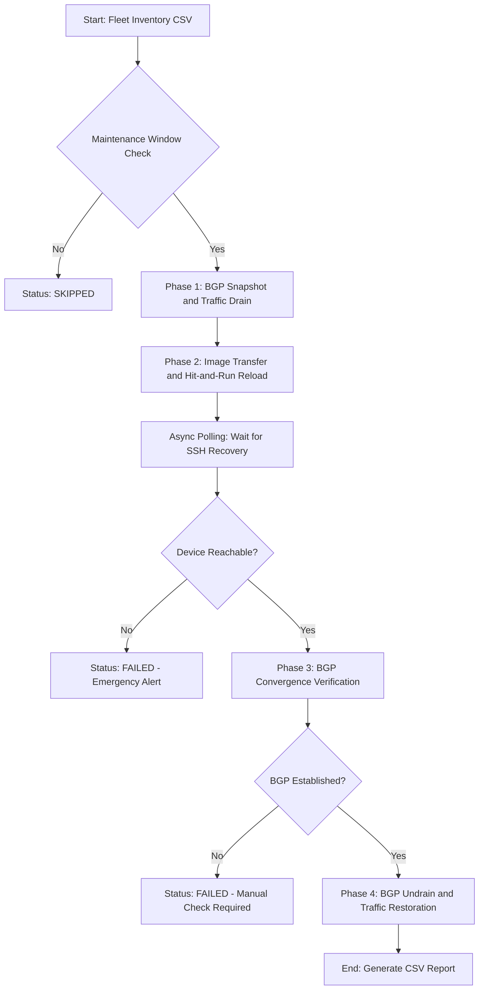

# Enterprise Arista Fleet Upgrade Framework


A production-grade, closed-loop network automation framework built with Python and `asyncio` to perform **Zero-Downtime OS upgrades** across thousands of Arista EOS devices — applying real-world SRE principles including traffic draining, convergence verification, and automated rollback detection.

---

## Overview

Traditional OS upgrades require manual SSH sessions, risky maintenance windows, and no automated verification. This framework replaces that entirely — orchestrating the full upgrade lifecycle from BGP traffic drain to post-upgrade convergence check, with full async concurrency across the fleet.

Designed for scale: tested against a Containerlab simulation of Arista cEOS nodes, architected for 6,000+ device fleets.

---

## Core Features

| Feature | Description |
|---|---|
| Zero-downtime drain | AS-Path Prepending and outbound Route-Maps shift traffic before any reload |
| Async concurrency | `asyncio` + `Semaphore(50)` runs 50 parallel SSH sessions safely |
| Hit-and-Run reload | Handles abrupt SSH disconnection during device reload gracefully |
| Convergence verification | Polls BGP state post-reload — only undrains when `Established` confirmed |
| Timezone-aware scheduling | Upgrades run inside each site's approved maintenance window |
| Automated reporting | Full `upgrade_report.csv` generated on completion |
| Structured logging | Rotating logs with per-phase named loggers |

---

## Architecture



---

## Project Structure

```
arista-upgrade-framework/
├── inventory/
│   └── devices.csv               # Fleet inventory: IP, ASN, timezone, platform
├── src/
│   ├── main.py                   # Core async orchestrator
│   ├── config.py                 # Environment variables and global settings
│   └── phases/
│       ├── phase1_pre_check.py   # BGP snapshot and traffic drain
│       ├── phase2_upgrade.py     # Image transfer, boot var, reload
│       └── phase3_post_check.py  # Convergence verification and undrain
├── logs/                         # Rotating execution logs
├── requirements.txt
└── README.md
```

---

## Quick Start

```bash
# clone
git clone https://github.com/atr399/arista-upgrade-framework
cd arista-upgrade-framework

# create virtual environment
python3 -m venv .venv
source .venv/bin/activate

# install dependencies
pip install -r requirements.txt

# run against lab
python -m src.main
```

---

## Inventory Format

```csv
hostname,ip,asn,platform,timezone,target_version
arista-sin-01,172.20.20.2,65001,arista_eos,Asia/Singapore,4.31.0F
arista-sin-02,172.20.20.3,65002,arista_eos,Asia/Singapore,4.31.0F
```

---

## Technologies

| Tool | Purpose |
|---|---|
| Python 3.10+ | Core language |
| asyncio | Concurrent SSH — non-blocking I/O |
| Scrapli (AsyncEOSDriver) | Native async SSH to Arista EOS |
| asyncio.Semaphore | Limits concurrent connections to 50 |
| Containerlab | Lab topology simulation |
| Arista cEOS 4.30.1F | Virtual Arista devices |
| pathlib | Cross-platform path management |
| logging | Rotating structured logs per phase |

---

## Key Design Decisions

**Why asyncio over ThreadPoolExecutor?**

For I/O-bound SSH tasks at scale, `asyncio` with a native async SSH library (Scrapli) uses a single thread and never blocks the event loop. At 6,000 devices, this is significantly more memory-efficient than spawning 50+ OS threads.

**Why Semaphore(50)?**

Firing 6,000 simultaneous SSH connections overwhelms device control planes and triggers firewall rate limiting. The semaphore acts as a concurrency limiter — 50 active sessions at any moment, with others queued automatically.

**Why generator for inventory loading?**

```python
def load_inventory(filepath):
    with open(filepath) as f:
        for row in csv.DictReader(f):
            yield {k: v.strip() for k, v in row.items()}
```

A generator never loads all 6,000 rows into memory at once. Each row is processed and discarded. For large fleets this is critical.

---

## Lab Setup

```bash
# deploy containerlab topology
sudo containerlab deploy -t topology.yml

# verify devices are up
docker exec -it clab-arista-upgrade-lab-arista-sin-01 /usr/bin/CliShell
```

---

## Sample Output

```
2026-04-03 17:01:26 - Orchestrator - INFO - Starting Arista OS Upgrade Framework [Phase 1]
2026-04-03 17:01:26 - Orchestrator - INFO - [172.20.20.2] Connecting to device...
2026-04-03 17:01:28 - Orchestrator - INFO - [172.20.20.2] BGP state captured — 1 peer Established
2026-04-03 17:01:29 - Orchestrator - INFO - [172.20.20.2] Traffic drain initiated via AS-Path Prepend
2026-04-03 17:01:30 - Orchestrator - INFO - All Phase 1 tasks completed across the fleet.
```

---

## For Burmese Network Engineers (မြန်မာ Engineers များအတွက်)

ဤ Framework သည် Arista EOS စက်ပေါင်းများစွာကို Network လုံးဝ Down မသွားစေဘဲ OS အဆင့်မြှင့်တင်ပေးနိုင်သော Production-grade Automation Tool ဖြစ်ပါသည်။

**AsyncIO ကို ဘာကြောင့် သုံးသလဲ?**

စားဆိုင် Waiter တစ်ယောက်နဲ့ တူပါတယ် — စားပွဲ (၁) ဆီ Order ယူပြီး ဟင်းကျက်တာ စောင့်မနေဘဲ စားပွဲ (၂), (၃) ဆီ ဆက်သွားပါတယ်။ Python တစ်ချောင်းတည်းနဲ့ SSH Connection ထောင်ပေါင်းများစွာကို တစ်ပြိုင်နက် ကိုင်တွယ်နိုင်ပါတယ်။

**Semaphore ကို ဘာကြောင့် သုံးသလဲ?**

Connection ၆,၀၀၀ ကို တစ်ချိန်တည်း ဖွင့်လိုက်ရင် Router/Firewall တွေ ထိခိုက်နိုင်ပါတယ်။ Semaphore သည် တစ်ချိန်တည်း Connection အများဆုံး ၅၀ ခုသာ ဖွင့်ခွင့်ပြုသော Bouncer တစ်ယောက်လို လုပ်ဆောင်ပါတယ်။

---

## Author

**Aung** — Senior Network Engineer / VP Production Services Infrastructure Support  
CCIE Enterprise and Service Provider  
[GitHub: atr399](https://github.com/atr399)